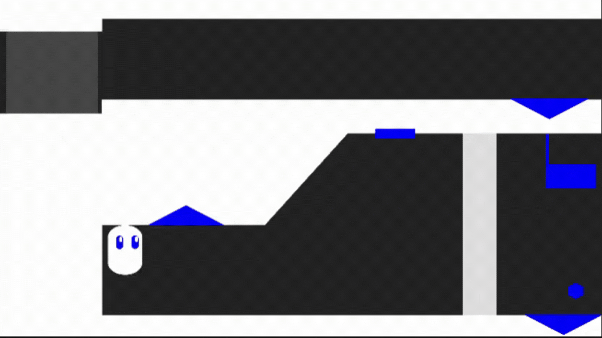
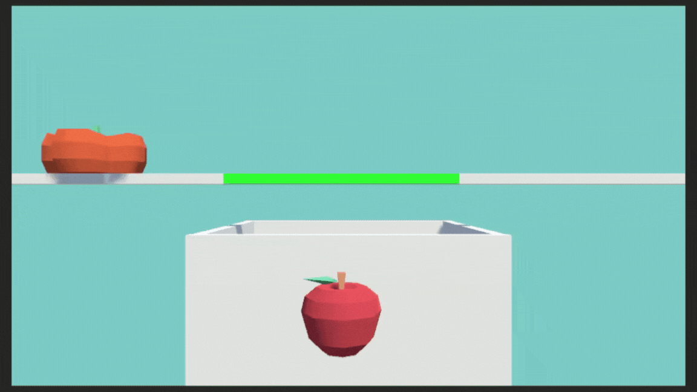
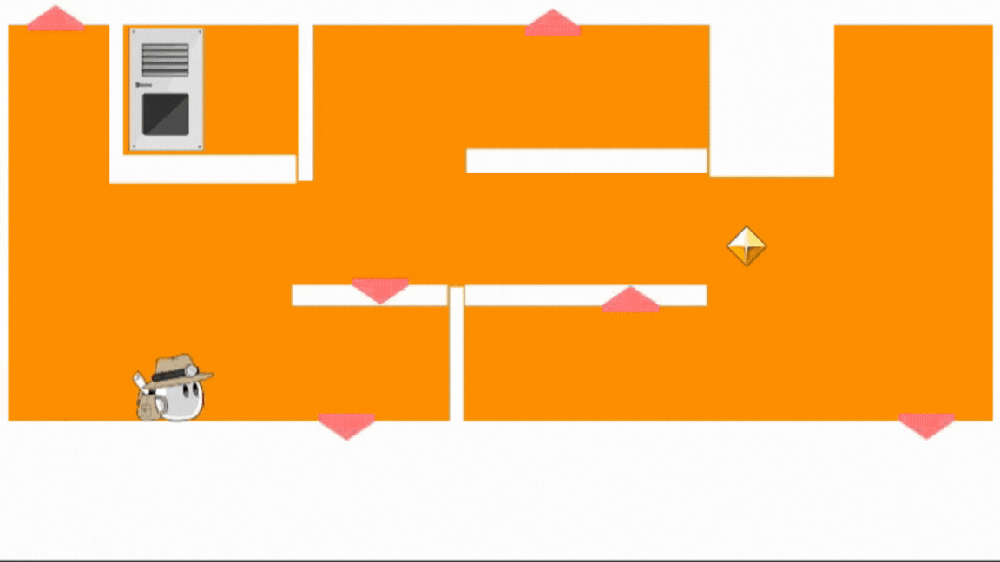

# Portfolio

- 堀 朱莉
- 連絡先 Twitter [@rum1341](https://twitter.com/rum1341)  / Email [hori.datgp@gmail.com](mailto:hori.datgp@gmail.com)
- 専門学校デジタルアーツ東京 ゲームプログラムコース 2024年卒業予定

## スキル
- C#
  - 利用歴2年
- Unity
  - 利用歴2年
  - オリジナルの個人作品の開発経験あり
- C/C++
  - 利用歴5年
  - ファイルの読み込みなど、簡単なものなら可能

## 取り組んでいるテーマ
1. unityでオリジナル2DADVゲーム開発

## 作品リスト

### RENDA RUN

[RENDA RUN](https://unityroom.com/games/rendarun)

画面を連打して小鳥を進めよう。マウスの右クリックで前進する連打ゲームです。

- 開発環境：Unity
- 開発期間：7日
- 一週間ゲームジャム「ためる」参加作品

### Re:verser（旧）

[Re:verser](https://unityroom.com/games/reverser)

重力や色をReverseして旗の元までたどり着け！反転を使って進むパズルゲームです。

- 開発環境：Unity
- 開発期間：9日
- 1週間ゲームジャム「Re」参加作品

### RINGO SYOKUNIN

[RINGO SYOKUNIN](https://unityroom.com/games/ringo-syokunin)

リンゴを見分けてタイミングよく箱に落とそう！リズム仕分けゲームです。

- 開発環境：Unity
- 開発期間：10日
- DATフェスタ展示作品

### Re:verser
[]

「反転」ギミックを使って扉までたどり着け！２Dアクション型簡単パズルゲームです。

- 開発環境：Unity
- 開発期間：約5ヶ月
- 卒業制作

### 最期の灯

[TheLastLight]()

静かな海と塔、そして灯。少年の過ごす最期の３日間。2D ADVです。

- 開発環境：Unity
- 開発期間：2023/12/18～

