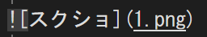

# 大見出し
## 中見出し
### 小見出し


**太字**
普通の文字

**ctrl+ｂ**

*斜体*　
*abcd*　abcd

~~取り消し~~

<sub>下付き文字</sub>
<sup>上付き文字</sup>
普通の文字

x<sub>２</sub>
x<sup>2</sup>


以下抜粋。

> ここに引用部分を書く。

整数は`int`型がよい。

```cs
if(a>namber)
{
  if(bannin==true)return;

  scene=1;
}
```
[REDME.mb](REDME.mb)へのリンク




- 箇条書き
   - 段下げ(スペース３つ)
      - 段下げ２(スペース6つ)
- 続き

1. 順番1
   - 下げ
1. 順番2
   1.順番2-1
   1.順番2-2
1. 順番3

10. 順番は飛ばせない


- [ ] 作業１
- [x] 作業２
- [ ] 作業３


|No|氏名|フリガナ|
|-:|:-:|:-|
|1|田中|タナカ|
|2|デジタルアーツ|デジタルアーツ|
|3|池袋|イケブクロ|
||||
|右揃え|真ん中揃え|左揃え|